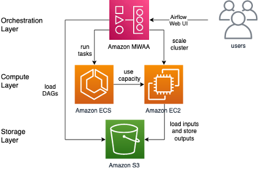
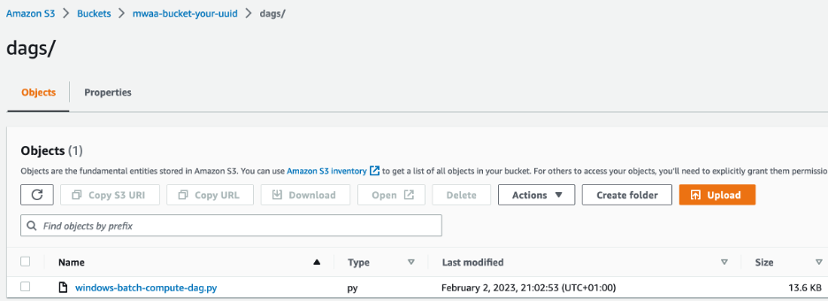
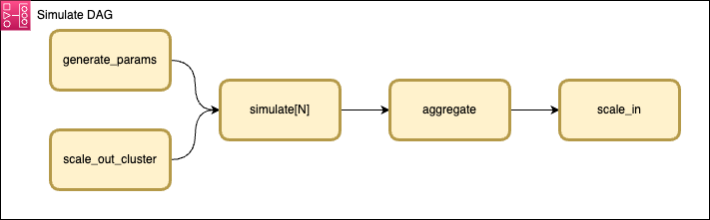
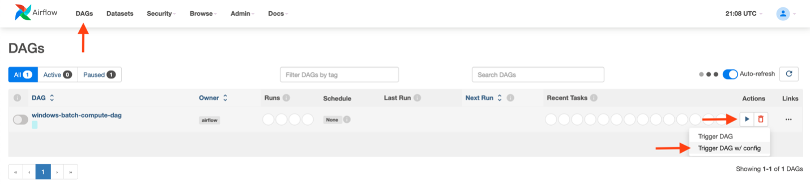
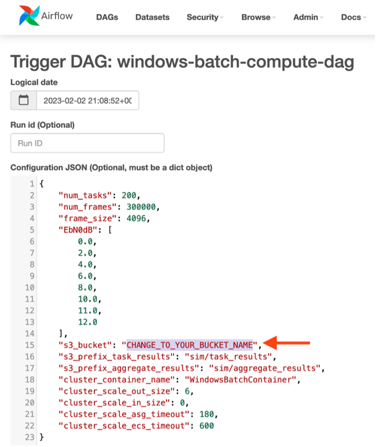
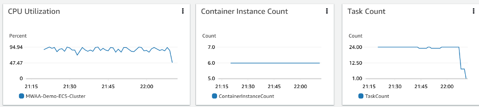
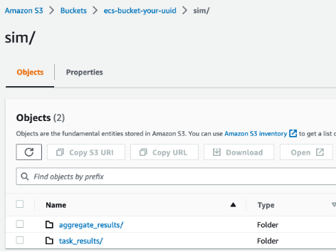
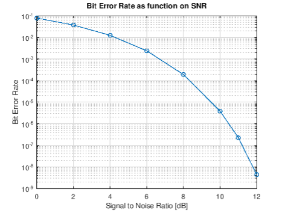

# Batch processing for Microsoft Windows Server workloads on AWS

## About
This sample corresponds to the AWS Blog Post _[Batch processing for Microsoft Windows Server workloads on AWS](https://aws.amazon.com/blogs/modernizing-with-aws/batch-processing-for-microsoft-windows-server-workloads-on-aws/)_.

The sample provides a reusable and general framework for running Windows Server batch processing workloads on AWS. We will show you how to leverage [Amazon Managed Workflows for Apache Airflow (Amazon MWAA)](https://aws.amazon.com/managed-workflows-for-apache-airflow/) to orchestrate batch jobs with [Amazon Elastic Container Service (Amazon ECS)](https://aws.amazon.com/ecs/), which provides the compute runtime for Windows Containers. We will provide step-by-step instructions and [AWS CloudFormation](https://aws.amazon.com/cloudformation/) templates, allowing you to go hands-on and experiment with the setup and customize it to your needs.

## Table of Contents
* [Batch processing for Microsoft Windows Server workloads on AWS](#batch-processing-for-microsoft-windows-server-workloads-on-aws)
   * [About](#about)
   * [Table of Contents](#table-of-contents)
   * [Solution overview](#solution-overview)
      * [Orchestration layer](#orchestration-layer)
      * [Compute layer](#compute-layer)
      * [Storage layer](#storage-layer)
   * [Walkthrough](#walkthrough)
      * [Creating the infrastructure](#creating-the-infrastructure)
      * [Running a simulation batch job](#running-a-simulation-batch-job)
         * [Overview of the batch job structure](#overview-of-the-batch-job-structure)
         * [Create and monitor the simulation](#create-and-monitor-the-simulation)
         * [Diving deeper and customizing the sample](#diving-deeper-and-customizing-the-sample)
   * [Cleaning up](#cleaning-up)
   * [Conclusion](#conclusion)
* [Security](#security)
* [License](#license)

## Solution overview
The following diagram shows a high-level overview of the solution with the individual layers described in more detail.

### Orchestration layer
Amazon MWAA is used to orchestrate compute tasks and model dependencies between them. For example, for a particular workflow, you may first need to pre-process the source data, then run simulations and aggregate the results.

In the context of Airflow, workflows are defined using [Direct Acyclic Graphs (DAGs)](https://airflow.apache.org/docs/apache-airflow/stable/core-concepts/dags.html) written in Python, which allows for flexible modeling of complex dependencies between tasks. Next to running the actual batch compute jobs, tasks in a workflow can be used to perform actions on the underlying infrastructure. Examples include scaling up a cluster for subsequent parallel processing or scaling it down once an upstream batch job has completed.

Once a DAG is initialized and registered with Amazon MWAA, you can take a no-code approach towards running your Windows batch jobs. MWAA comes with a web-based [Airflow UI](https://airflow.apache.org/docs/apache-airflow/stable/ui.html). You can use this to run workflows, configure inputs, and monitor progress. [The web UI user database can also be integrated with external identity providers](https://aws.amazon.com/blogs/compute/using-okta-as-an-identity-provider-with-amazon-mwaa/) and supports common enterprise authentication protocols.

### Compute layer
We leverage Amazon ECS to provide the compute capacity for Windows batch jobs using [Amazon Elastic Compute Cloud (Amazon EC2)](https://aws.amazon.com/ec2/). Individual tasks run independently and isolated from one another as Docker containers. In this solution, we rely on [Amazon ECS optimized Windows AMIs provided by AWS](https://docs.aws.amazon.com/AmazonECS/latest/developerguide/ECS_Windows.html).

For more information on Windows AMIs, refer to the [Microsoft Software Supplemental License for Windows Container Base Image](https://learn.microsoft.com/en-us/virtualization/windowscontainers/images-eula). To learn more about Microsoft licensing options for Amazon ECS optimized AMIs, refer to the [Licensing – Windows Server section in the AWS and Microsoft FAQ](https://aws.amazon.com/windows/faq/#licensing).

Amazon EC2-based clusters are well suited for batch workloads, allowing for more direct access to the underlying infrastructure – for example, if GPU access or access to instance storage or [Amazon Elastic Block Store (EBS)](https://aws.amazon.com/ebs/) is required. Windows workloads containers can be large, resulting in container download and extraction taking longer than compute time. For jobs that consist of many short subsequent tasks, caching the container image on Amazon EC2 instances will greatly reduce the total runtime since the container download and extraction time is incurred only once.

### Storage layer
You will use [Amazon Simple Storage Service (Amazon S3)](https://aws.amazon.com/s3/) to store inputs and outputs of batch jobs. The solution can be customized to provide jobs with access to Amazon EC2 instance storage or leverage Amazon EBS volumes for jobs that have high data throughput and can take advantage of local storage. If shared storage is needed, [Amazon FSx for Windows File Server](https://aws.amazon.com/fsx/windows/) can easily be added to the solution as a high performance and robust shared storage service.

## Walkthrough

Going through this example will take approximately two hours (most of which will be waiting for infrastructure to deploy and batch simulation to finish computing) and generate about $5 of AWS charges to the AWS Account used. No special prerequisites are required other than access to an AWS account via the AWS management console.

### Creating the infrastructure

Perform the following steps in the console to deploy the infrastructure:
1. In the [Amazon S3 console](https://s3.console.aws.amazon.com/s3/buckets?region=us-east-1), [create a bucket](https://docs.aws.amazon.com/AmazonS3/latest/userguide/create-bucket-overview.html) for storing the Amazon MWAA DAG. Choose a unique name for the bucket such as `mwaa-bucket-your-uuid` (where `your-uuid` can be any unique identifier).
1. In this bucket, create a folder named `dags`, [download the sample DAG file](dags/windows-batch-compute-dag.py), and upload it to the `dags` folder:
   
1. Click  
 to deploy the Amazon MWAA infrastructure. Choose a stack name (like `mwaa-stack`), and for the `AirflowBucketName` parameter, enter the bucket from the previous step (`mwaa-bucket-your-uuid` in the previous example). Click **Next** and **Submit** to create the stack.
1. Create another Amazon S3 bucket for storing the output files your batch jobs. Again, select a unique name, such as `ecs-bucket-your-uuid`.
1. Click 
to deploy the Amazon ECS infrastructure. Choose a stack name (such as `ecs-stack`) and input e.g. `ecs-bucket-your-uuid` for the `EcsBucketName` parameter.

Alternatively, if you prefer a CLI-based workflow over the console method described previously, you can clone this repository and run the [`deploy.sh`](deploy.sh) script.

Creation of the CloudFormation stacks (in particular the MWAA part) can take up to 35 minutes. Check the [CloudFormation console](https://us-east-1.console.aws.amazon.com/cloudformation/home#/stacks) to monitor the progress. Once both stacks are in `CREATE_COMPLETE` state, navigate to the [MWAA console](https://us-east-1.console.aws.amazon.com/mwaa/home#environments) and click on **Open Airflow UI** for the `MWAA-Batch-Compute-Environment`.

### Running a simulation batch job
#### Overview of the batch job structure
In the Airflow UI, click on **windows-batch-compute-dag** and select the **Graph** tab to inspect the DAG we use in context of this example. The following diagram shows its structure:

The first task scales up the Amazon ECS cluster to achieve the desired degree of parallelism for the subsequent compute tasks. Each compute task runs a simulation within a Windows container on the Amazon ECS cluster, which uploads a results file to Amazon S3 when finished. Once all compute tasks finish, another Amazon ECS task aggregates the results to provide an aggregated output. Finally, the last task scales down the Amazon ECS cluster. More details on the actual simulation workload are provided at the end of this section.

#### Create and monitor the simulation
Return to the DAGs overview and kick off a batch simulation by clicking **Trigger DAG w/ config** as shown in the following screenshot:

You will then be prompted to configure simulation parameters, as follows:

Set the name of the Amazon S3 bucket to the one created earlier for storing Amazon ECS task outputs (for example `ecs-bucket-your-uuid`) and click **Trigger**. The following sequence of events will then happen in context of the batch job you just submitted, taking about 1 hour to complete:
1. The Amazon ECS cluster will be scaled up to six instances (of type c5.xlarge, unless you changed the defaults when deploying the Amazon ECS stack). The entire cluster with the default configuration has 24 vCPUs and 48GB of memory available to run simulation tasks in parallel.
1. Once the scale up task completes, the Amazon ECS cluster will start to run simulation tasks. The [MWAA environment will automatically scale](https://docs.aws.amazon.com/mwaa/latest/userguide/mwaa-autoscaling.html) and increase the number of workers until it can handle 24 concurrent tasks to load the Amazon ECS cluster fully. Each individual task is running a simulation in the context of a Windows container on the Amazon ECS cluster and will take about 5 minutes to complete and will upload its result to the Amazon S3 bucket. Overall, 200 simulations tasks will be run, with at most 24 in parallel due to the cluster size and resource requirements of each task. You can check the [Container Insights Console](https://us-east-1.console.aws.amazon.com/cloudwatch/home#container-insights:infrastructure) to monitor the state of your cluster, as shown in the following figure:

1. Once all simulation tasks have completed, an aggregate task reads all outputs from preceding tasks from Amazon S3 and combines them into a single file to generate a plot.
1. Finally, a scale-in task sets the cluster size to zero.

You can monitor the progress in the Airflow UI. Once the DAG run finishes, you can check the results file generated in the Amazon S3 bucket. Specifically, the prefix `sim/task_results` should contain 200 files, one per task completed, while the `sim/aggregate_results` task stores the combined results and a corresponding visualization plot in form of a PNG file:

#### Diving deeper and customizing the sample
Now let’s have a look and dive deeper into the actual simulation workload. For illustration purposes, we have created a simple compute simulation that calculates the Bit Error Rate (BER) of a telecommunication channel depending on its Signal Noise Ratio (SNR) using the free [GNU Octave](https://octave.org/) software to running inside the Windows containers.

The `results.png` file contained in the `sim/aggregate_results` prefix is shown in the following image:

Individual points on this curve are the combined result of the 200 simulation tasks that we just ran across six Windows instances on the Amazon ECS cluster. The final aggregation job then examined all the individual task results and counted the overall number of erroneous bits in order to generate this plot.

This repository holds all of the details. In particular, the [Docker section](docker/README.md) contains the simulation scripts and instructions to build the container and run the simulation. The [DAG file](dags/windows-batch-compute-dag.py) contains the overall orchestration logic to run this sample end-to-end. If you intend to build customized containers with specialized software and workflows, dive deep here to understand how these components tie together so that you can apply them successfully to your workloads.

## Cleaning up
[Empty](https://docs.aws.amazon.com/AmazonS3/latest/userguide/empty-bucket.html) and [delete]() both Amazon S3 buckets. [Delete both CloudFormation stacks](https://docs.aws.amazon.com/AWSCloudFormation/latest/UserGuide/cfn-console-delete-stack.html) created earlier.

## Conclusion
In this sample, we showed how Amazon Managed Workflows for Apache Airflow can be used to simplify and modernize Windows batch computing workflows on AWS. Amazon MWAA provides an interactive UI to create, monitor, and manage batch workflows. The UI enhances usability and makes activities like reviewing the state of jobs and gathering runtime information like logs, duration, and status accessible to non-technical users.

Using Amazon EC2 Windows containers, customers can focus on their applications and use Windows AMIs without worrying about potential interference between the operating system and their application. In conjunction with Amazon ECS, Amazon MWAA enables customers to take advantage of elastic compute resources on AWS, enabling scalable batch computing workloads and control over parallelism and runtime.

You can start tailoring our solution to your needs with this repository.

# Security

See [CONTRIBUTING](CONTRIBUTING.md#security-issue-notifications) for more information.

# License

This repository is licensed under the MIT-0 License. See the LICENSE file.

Although this repository is released under the MIT-0 license, its Dockerfile uses Windows as a base image. 
Microsoft's licensing includes the EULA (https://learn.microsoft.com/en-us/virtualization/windowscontainers/images-eula).
